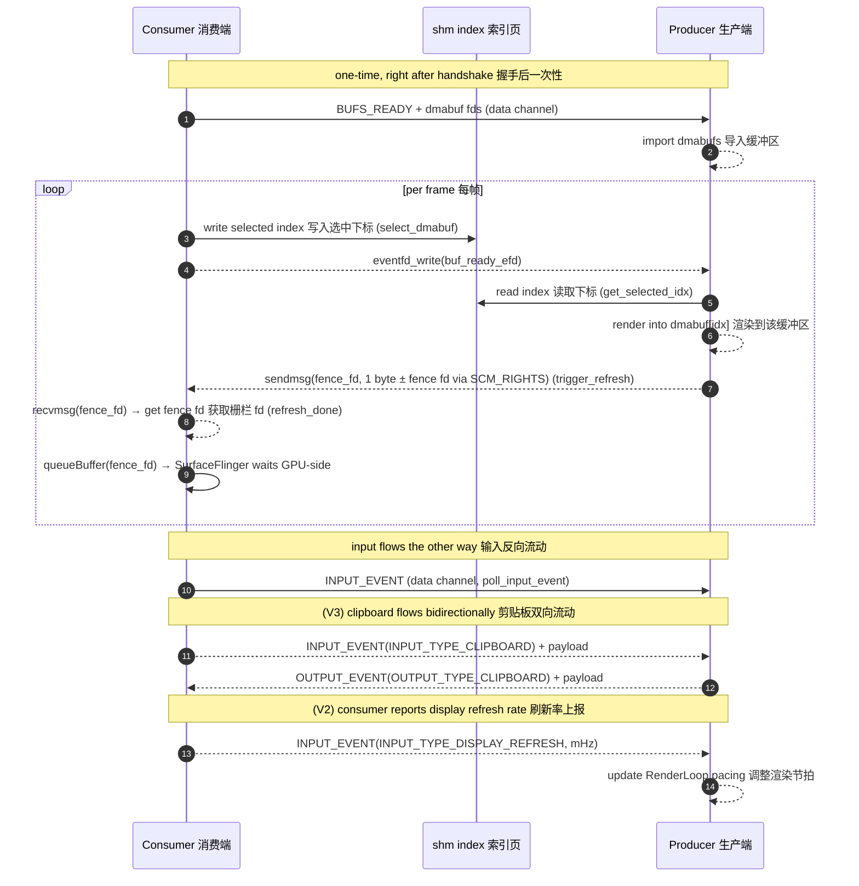
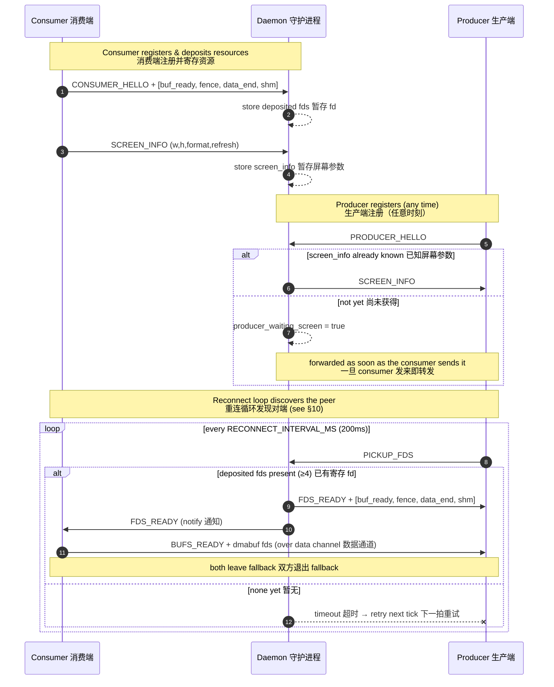
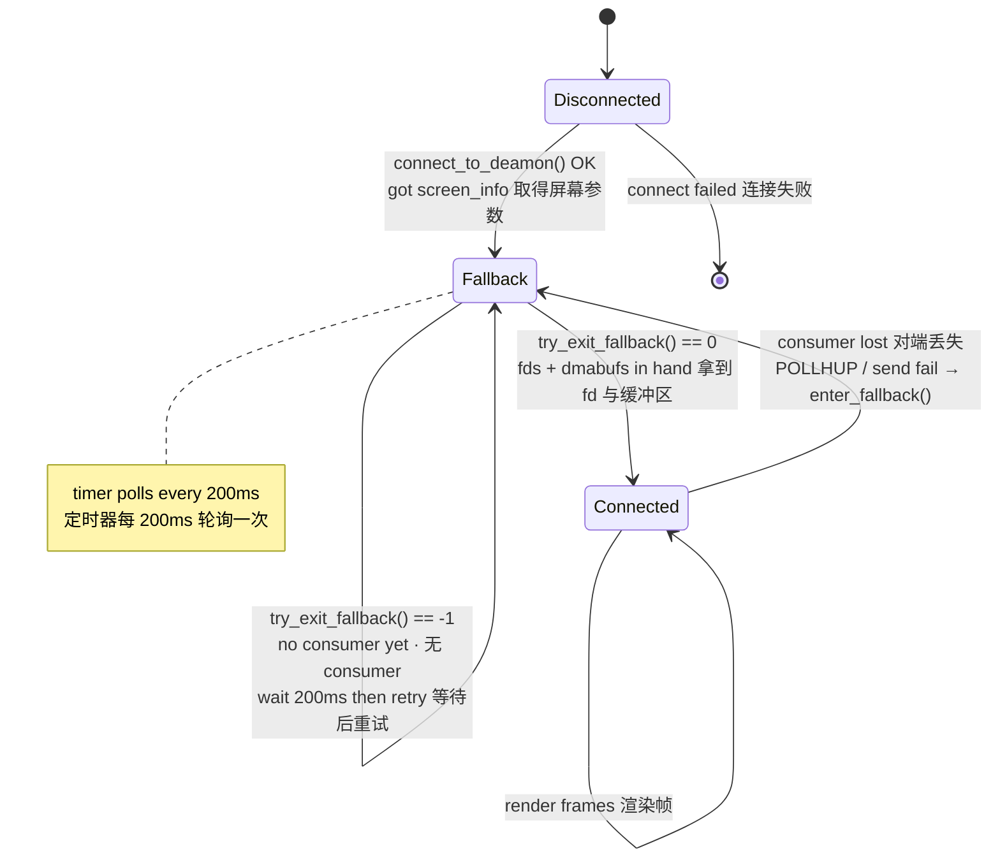
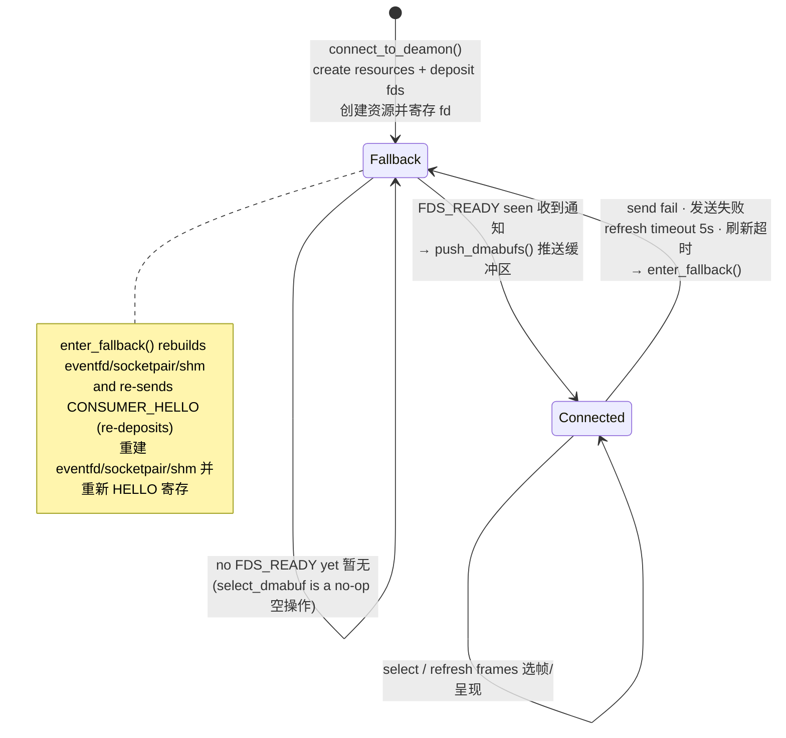

# Anland Display Protocol V3 — Anland 显示协议 V3

> A buffer‑sharing protocol that lets a Linux compositor (KWin / Weston) render its
> desktop into GPU buffers that an Android surface presents, brokered by a small
> daemon over a Unix domain socket.
>
> **V3** adds **bidirectional clipboard exchange** — the producer (compositor) and
> consumer (Android display) can push clipboard content to each other over the data
> channel. Clipboard data uses a **variable‑length** two‑packet protocol (header +
> payload), which introduces **ABI and API incompatibilities** with V2: callers must
> handle all event types or explicitly drain unhandled variable‑length payloads.
>
> 一套缓冲区共享协议：Linux 合成器（KWin / Weston）把桌面渲染进 GPU 缓冲区，
> 由 Android 端的显示表面进行呈现，二者通过一个轻量守护进程在 Unix 域套接字上完成对接。
>
> **V3** 新增**双向剪贴板交换**——producer（合成器）与 consumer（Android 显示）
> 可通过数据通道互相推送剪贴板内容。剪贴板数据采用**变长**两包协议（头部 + 负载），
> 这引入了与 V2 的 **ABI 和 API 不兼容**：调用者必须处理所有事件类型，
> 或显式丢弃未处理的变长负载。

---

## 1. Roles · 角色

| Role 角色 | Binary 程序 | Responsibility 职责 |
|-----------|-------------|---------------------|
| **Daemon** 守护进程 | `daemon` | Rendezvous broker. Holds **at most one** consumer and **one** producer, stores the screen info, and passes file descriptors between them with `SCM_RIGHTS`. **Unchanged from V2.** 充当对接中介，最多保存一个 consumer 与一个 producer，缓存屏幕信息，并通过 `SCM_RIGHTS` 在两者间传递文件描述符。**与 V2 相同，无需更新。** |
| **Consumer** 消费端 | Android app / `test_sdl_consumer` | **Owns the resources.** Allocates the dmabufs, the buffer‑ready eventfd, the shm index page, and **two** socketpairs (`data` + `fence`), and *presents* the rendered frames. In V3 also **receives clipboard data** from the producer. 拥有全部资源：分配 dmabuf、buffer‑ready eventfd、shm 索引页与**两条** socketpair（`data` + `fence`），并最终**呈现**已渲染的帧。V3 还负责**接收 producer 发来的剪贴板数据**。 |
| **Producer** 生产端 | KWin / Weston `backend‑anland` | The compositor. *Renders* desktop content into the consumer's shared buffers. In V3 also **receives clipboard data** from the consumer and **sends clipboard data** to the consumer. 即合成器，把桌面内容**渲染**进 consumer 提供的共享缓冲区。V3 还负责**接收 consumer 发来的剪贴板数据**并**向 consumer 发送剪贴板数据**。 |

> [!NOTE]
> **Naming 命名**: the *producer* produces pixel content; the *consumer* consumes
> (displays) it. The consumer is the resource owner because it is the side that
> physically scans the buffers out to the panel.
> "producer" 生产像素内容，"consumer" 消费（显示）这些内容。consumer 是资源拥有者，
> 因为它才是把缓冲区真正扫描输出到屏幕的一方。

---

## 2. V3 changes at a glance · V3 变更概览

| Aspect 方面 | V2 | V3 | Impact 影响 |
|-------------|----|----|-------------|
| Clipboard clipboard 剪贴板 | Consumer → Producer only 单向 | **Bidirectional 双向** | 新增 `DATA_MSG_OUTPUT_EVENT`(103) P→C 方向 |
| Variable‑length events 变长事件 | Not used 未使用 | `clipboard.size` + trailing payload | ❌ **ABI 不兼容**：旧版 `poll_input_event()` 无法排空变长负载，导致流损坏 |
| `handle_unhandled_event()` | Not required 不需要 | **必须调用** | ❌ **API 不兼容**：未处理的变长事件必须显式排空 |
| `push_input_event_with_length()` / `push_output_event_with_length()` | Not required 不需要 | **剪贴板必须使用** | 签名不变，但变长事件**不得**用 `push_input_event()` / `push_output_event()` 发送 |
| Daemon 守护进程 | — | **不变** | 零改动 |

> [!CAUTION]
> **ABI incompatibility · ABI 不兼容**: a V3 consumer may send `INPUT_TYPE_CLIPBOARD`
> events whose trailing payload bytes exceed `sizeof(struct InputEvent)`. A V2
> producer that only calls `poll_input_event()` (which reads exactly one fixed‑size
> `InputEvent`) will **leave the trailing bytes in the socket buffer**, corrupting
> all subsequent messages. The same applies in the reverse direction for
> `DATA_MSG_OUTPUT_EVENT` with clipboard payloads.
>
> V3 consumer 可能发送 `INPUT_TYPE_CLIPBOARD` 事件，其尾随负载字节超过
> `sizeof(struct InputEvent)`。仅调用 `poll_input_event()`（读取恰好一个固定大小
> `InputEvent`）的 V2 producer 会**将尾随字节留在 socket 缓冲区中**，
> 损坏所有后续消息。反方向的 `DATA_MSG_OUTPUT_EVENT` + 剪贴板负载同理。

---

## 3. Transport & Channels · 传输与通道

There are **four** communication paths — same as V2, with the fence channel using
a **socketpair** and the data channel now carrying **variable‑length output events**.

共有**四条**通信路径——与 V2 相同，fence 通道使用 **socketpair**，
数据通道现承载**变长输出事件**。

| Channel 通道 | Kind 类型 | Created by 创建者 | Carries 承载内容 |
|--------------|-----------|-------------------|------------------|
| **Control** 控制通道 | `AF_UNIX` `SOCK_STREAM` to daemon | each peer 各端各一条 | `ctrl_msg` handshake messages 握手控制消息 |
| **Data** 数据通道 | `socketpair()` | Consumer | `data_msg`: dmabuf set + input events + **output events** 缓冲区集合、输入事件与**输出事件** |
| **buf_ready** | `eventfd` | Consumer | Consumer → Producer: "a buffer is selected, render it" 已选定缓冲区，请渲染 |
| **fence** | `socketpair()` | Consumer | Producer → Consumer: render‑done message + optional `SCM_RIGHTS` fence fd 渲染完成消息 + 可选栅栏 fd |
| **shm index** 索引页 | 4‑byte `memfd` | Consumer | selected buffer index 当前选中的缓冲区下标 |

Default daemon socket path · 守护进程默认套接字路径:
`/data/local/tmp/display_daemon.sock`

All control/data framing uses a fixed 8‑byte header followed by an optional payload
(`common/protocol.h`):

所有控制/数据帧都是固定 8 字节头部加可选负载（见 `common/protocol.h`）：

```c
struct ctrl_msg { uint32_t type; uint32_t size; uint8_t payload[]; } __attribute__((packed));
struct data_msg { uint32_t type; uint32_t size; uint8_t payload[]; } __attribute__((packed));
```

`size` is the payload length in bytes (header excluded). Reliable framing helpers
`send_all` / `recv_all` and the ancillary‑fd helpers `send_fds` / `recv_fds` live in
`common/socket_utils.c`.

`size` 为负载字节数（不含头部）。可靠收发函数 `send_all` / `recv_all` 及附带 fd 的
`send_fds` / `recv_fds` 见 `common/socket_utils.c`。

---

## 4. The four deposited descriptors · 寄存的四个描述符

When the consumer says hello it attaches **four** fds (via `SCM_RIGHTS`), in this exact
order — see `send_hello_fds()` in `display_consumer.c`:

consumer 打招呼时通过 `SCM_RIGHTS` 附带**四个** fd，顺序固定如下
（见 `display_consumer.c` 的 `send_hello_fds()`）：

| Index 下标 | Direction 方向 | Purpose 用途 |
|:---------:|----------------|--------------|
| `fds[0]` | C → P | `buf_ready_efd`: consumer signals a selected buffer 选定缓冲区的信号 |
| `fds[1]` | P → C | `fence_fd` socketpair 写端: render‑done message + optional fence fd via `SCM_RIGHTS` |
| `fds[2]` | C ↔ P | data‑channel end: the producer's end of the socketpair socketpair 的 producer 端 |
| `fds[3]` | C → P | `shm_fd`: the 4‑byte selected‑index page 4 字节索引页 |

> **V3 无变更**：fd 槽位与 V2 完全相同

The consumer keeps `sv[0]` as its own `data_fd` and deposits `sv[1]`. The daemon stores
these as **deposited fds** and hands them to the producer on request. **The daemon is
opaque to the fd semantics — no daemon update needed.**

consumer 自留 `sv[0]` 作为自身 `data_fd`，寄存 `sv[1]`。守护进程把这些保存为
**deposited fds**，待 producer 请求时转交。**Daemon 不感知 fd 语义，无需更新。**

---

## 5. Message reference · 消息参考

### 5.1 Control messages (control channel) · 控制消息（控制通道）

| Message 消息 | Value | Direction 方向 | Payload / FDs 负载/描述符 | Meaning 含义 |
|--------------|:-----:|----------------|---------------------------|--------------|
| `CTRL_MSG_CONSUMER_HELLO` | 1 | C → D | + 4 fds | register as consumer & deposit fds 注册为 consumer 并寄存 fd |
| `CTRL_MSG_PRODUCER_HELLO` | 2 | P → D | — | register as producer 注册为 producer |
| `CTRL_MSG_SCREEN_INFO`    | 7 | C → D, D → P | `screen_info` | publish / forward screen geometry 发布/转发屏幕参数 |
| `CTRL_MSG_REJECT`         | 8 | D → C | — | screen‑info mismatch, connection refused 屏幕参数冲突，拒绝 |
| `CTRL_MSG_PICKUP_FDS`     | 9 | P → D | — | producer asks for the deposited fds producer 索取寄存的 fd |
| `CTRL_MSG_FDS_READY`      | 10 | D → P (+4 fds), D → C (notify) | + 4 fds to producer | fds handed over 描述符已交付 |

### 5.2 Data messages (data channel) · 数据消息（数据通道）

| Message 消息 | Value | Direction 方向 | Payload / FDs 负载/描述符 | Meaning 含义 |
|--------------|:-----:|----------------|---------------------------|--------------|
| `DATA_MSG_BUFS_READY` | 200 | C → P | `N × buf_info` + `N` dmabuf fds | the shared dmabuf set 共享缓冲区集合 |
| `DATA_MSG_INPUT_EVENT`| 102 | C → P | `InputEvent` | touch / key / pointer / clipboard / display refresh 触摸/按键/指针/剪贴板/显示刷新率 |
| `DATA_MSG_OUTPUT_EVENT`| **103** | **P → C** | `OutputEvent` | **clipboard** from producer (**V3 双向剪贴板**) |
| `DATA_MSG_BUF_READY`  | 100 | — | *reserved* 保留 | superseded by `buf_ready_efd` 由 eventfd 取代 |
| `DATA_MSG_REFRESH_DONE`| 101 | — | *reserved* 保留 | superseded by **fence channel** 由 fence 通道取代 |

### 5.3 Structures · 结构体

```c
struct screen_info { uint32_t width, height, format, refresh; };          // 屏幕参数

struct buf_info {                                                          // 单个 dmabuf 描述
    uint32_t stride;
    uint32_t width;      /* buffer logical width  (consumer-side native resolution) */
    uint32_t height;     /* buffer logical height (consumer-side native resolution) */
    uint32_t format;
    uint64_t modifier;
    uint32_t offset;
};

struct InputEvent {                                                        // 输入事件 (V2 定义, V3 增加 clipboard)
    uint32_t type;
    union {
        struct { int32_t action; float x, y; int32_t pointer_id; } touch;
        struct { int32_t action; int32_t keycode; } key;
        struct { float x, y, dx, dy; } pointer_motion;
        struct { uint32_t button; int32_t pressed; } pointer_button;
        struct { uint32_t axis; float value; int32_t discrete; } pointer_axis;
        struct { uint32_t refresh_mhz; } display;               // V2: 显示刷新率 (milli‑Hz)
        struct { uint32_t size; } clipboard;                    // V3: 剪贴板通知包 (header, 后跟变长数据)
        struct { uint32_t padding[4]; };                        // 保证 union 大小一致
    };
} __attribute__((packed));

struct OutputEvent{                                                      // 输出事件
    uint32_t type;
    union {
        struct { uint32_t size; } clipboard;                    // V3: 剪贴板通知包 (header, 后跟变长数据)
        struct { uint32_t padding[4]; };                        // 保证 union 大小一致
    };
} __attribute__((packed));
```

#### InputEvent types · 输入事件类型

| Type 类型 | Value | V1 | V2 | V3 | Payload 负载 | 变长? |
|-----------|:-----:|:--:|:--:|:--:|--------------|:-----:|
| `INPUT_TYPE_TOUCH` | 1 | ✅ | ✅ | ✅ | `touch { action, x, y, pointer_id }` | 否 |
| `INPUT_TYPE_KEY` | 2 | ✅ | ✅ | ✅ | `key { action, keycode }` | 否 |
| `INPUT_TYPE_POINTER_MOTION` | 3 | ✅ | ✅ | ✅ | `pointer_motion { x, y, dx, dy }` | 否 |
| `INPUT_TYPE_POINTER_BUTTON` | 4 | ✅ | ✅ | ✅ | `pointer_button { button, pressed }` | 否 |
| `INPUT_TYPE_POINTER_AXIS` | 5 | ✅ | ✅ | ✅ | `pointer_axis { axis, value, discrete }` | 否 |
| `INPUT_TYPE_TOUCH_FRAME` | 6 | — | ✅ | ✅ | — (frame boundary) | 否 |
| `INPUT_TYPE_DISPLAY_REFRESH` | 7 | — | ✅ | ✅ | `display { refresh_mhz }` | 否 |
| `INPUT_TYPE_CLIPBOARD` | 8 | — | — | **✅ V3 新增** | `clipboard { size }` + variable‑length data | **是** |

#### OutputEvent types · 输出事件类型

| Type 类型 | Value | V2 | V3 | Payload 负载 | 变长? |
|-----------|:-----:|:--:|:--:|--------------|:-----:|
| `OUTPUT_TYPE_CLIPBOARD` | 1 | — | **✅ V3 新增** | `clipboard { size }` + variable‑length data | **是** |

> [!IMPORTANT]
> Per‑frame buffer hand‑off does **not** use data messages. The selected index travels
> through the `shm` page, `buf_ready_efd` (select) and the **fence channel**
> (render‑done + optional fence). — see §7.
> 逐帧的缓冲区交接**不**走数据消息。选中下标通过 `shm` 页、`buf_ready_efd`（选中）与
> **fence 通道**（渲染完成 + 可选栅栏）传递，详见 §7。

---

## 6. Variable‑length event protocol · 变长事件协议 (V3 关键变更)

V3 introduces **variable‑length events** on the data channel. Previously all
`InputEvent` and `OutputEvent` messages had a fixed size. In V3, clipboard events
carry a **header** packet (the fixed‑size event struct with `clipboard.size` set)
immediately followed by `clipboard.size` bytes of raw payload.

V3 在数据通道上引入**变长事件**。此前所有 `InputEvent` 和 `OutputEvent` 消息均为
固定大小。V3 中，剪贴板事件携带一个**头部**包（固定大小的事件结构体，
`clipboard.size` 已设置），后紧跟 `clipboard.size` 字节的原始负载。

### 6.1 Wire format · 线上格式

```
Standard event (fixed size):
┌──────────────────┬────────────────────┐
│ data_msg header  │ InputEvent/OutputEvent │
│ type + size(=20) │ type + union        │
└──────────────────┴────────────────────┘

Variable‑length event (V3 clipboard):
┌──────────────────┬────────────────────┬─────────────────────┐
│ data_msg header  │ InputEvent/OutputEvent │ payload bytes      │
│ type + size(=20) │ type + clipboard.size  │ (clipboard.size)   │
└──────────────────┴────────────────────┴─────────────────────┘
                        ▲ header ▲          ▲ trailing data ▲
```

> [!CAUTION]
> **The `data_msg.size` field always equals `sizeof(InputEvent)` or
> `sizeof(OutputEvent)` (20 bytes)** — it does NOT include the trailing payload.
> The trailing payload size is carried inside `clipboard.size`. Receivers must
> **additionally** read `clipboard.size` bytes after consuming the event struct.
>
> `data_msg.size` 字段始终等于 `sizeof(InputEvent)` 或 `sizeof(OutputEvent)`
> （20 字节）——**不包含**尾随负载。尾随负载大小由 `clipboard.size` 携带。
> 接收者在消费事件结构体后必须**额外**读取 `clipboard.size` 字节。

### 6.2 Sending rules · 发送规则

- **Clipboard events MUST use `push_*_with_length()`** — the `_with_length` variant
  appends the payload bytes in the same `send_all()` call.
  剪贴板事件**必须使用 `push_*_with_length()`**——`_with_length` 变体在同一次
  `send_all()` 调用中追加负载字节。
- **Non‑clipboard events use `push_*()`** — fixed‑size, no trailing data.
  非剪贴板事件使用 `push_*()`——固定大小，无尾随数据。

```c
// ✅ Correct: clipboard with variable‑length payload
struct InputEvent ev = { .type = INPUT_TYPE_CLIPBOARD, .clipboard.size = len };
push_input_event_with_length(ctx, &ev, text, len);

// ❌ WRONG: sending clipboard without trailing data
push_input_event(ctx, &ev);  // consumer receives event but NO payload → stream corruption
```

### 6.3 Receiving rules · 接收规则

When `poll_input_event()` or `poll_output_event()` returns an event with
`type == INPUT_TYPE_CLIPBOARD` or `type == OUTPUT_TYPE_CLIPBOARD`, the receiver
**MUST** drain the trailing payload by calling `poll_input_event_extend_data()` or
`poll_output_event_extend_data()`, even if it intends to discard the data.

当 `poll_input_event()` 或 `poll_output_event()` 返回 `type == INPUT_TYPE_CLIPBOARD`
或 `type == OUTPUT_TYPE_CLIPBOARD` 的事件时，接收者**必须**调用
`poll_input_event_extend_data()` 或 `poll_output_event_extend_data()` 排空尾随负载，
即使打算丢弃数据。

**Producer side · 生产端:**

```c
struct InputEvent ev;
if (poll_input_event(ctx, &ev, 16) > 0) {
    switch (ev.type) {
    case INPUT_TYPE_CLIPBOARD:
        // Option A: use the data
        poll_input_event_extend_data(ctx, buf, ev.clipboard.size, 1000);
        setSystemClipboard(buf, ev.clipboard.size);
        break;
    case INPUT_TYPE_DISPLAY_REFRESH:
        output->setRefreshRate(ev.display.refresh_mhz);
        break;
    // ... other fixed‑size events ...
    default:
        handle_unhandled_event(ctx, &ev);  // MUST drain unknown variable‑length events
        break;
    }
}
```

**Consumer side · 消费端:**

```c
struct OutputEvent ev;
if (poll_output_event(ctx, &ev, 100) > 0) {
    switch (ev.type) {
    case OUTPUT_TYPE_CLIPBOARD:
        poll_output_event_extend_data(ctx, buf, ev.clipboard.size, 1000);
        setAndroidClipboard(buf, ev.clipboard.size);
        break;
    default:
        handle_unhandled_event(ctx, &ev);  // MUST drain unknown variable‑length events
        break;
    }
}
```

### 6.4 `handle_unhandled_event()` · 排空未处理事件

Both libraries provide `handle_unhandled_event()` which drains the trailing payload
of known variable‑length event types that the caller did not process. **This function
is mandatory** — failing to call it (or `*_extend_data()`) for unprocessed clipboard
events leaves bytes in the socket buffer and corrupts the stream.

两个库都提供 `handle_unhandled_event()`，用于排空调用者未处理的已知变长事件类型
的尾随负载。**此函数是必须的**——对于未处理的剪贴板事件，不调用它（或 `*_extend_data()`）
会在 socket 缓冲区中留下字节并损坏流。

```c
// Producer: drain unhandled consumer events
void handle_unhandled_event(display_ctx *ctx, const struct InputEvent *event) {
    switch (event->type) {
    case INPUT_TYPE_CLIPBOARD:
        if (event->clipboard.size > 0) {
            void *payload = malloc(event->clipboard.size);
            if (payload) {
                poll_input_event_extend_data(ctx, payload, event->clipboard.size, 1000);
                free(payload);
            }
        }
        break;
    default:
        break;
    }
}

// Consumer: drain unhandled producer events
void handle_unhandled_event(display_ctx *ctx, const struct OutputEvent *event) {
    switch (event->type) {
    case OUTPUT_TYPE_CLIPBOARD:
        if (event->clipboard.size > 0) {
            void *payload = malloc(event->clipboard.size);
            if (payload) {
                poll_output_event_extend_data(ctx, payload, event->clipboard.size, 1000);
                free(payload);
            }
        }
        break;
    default:
        break;
    }
}
```

---

## 7. Steady‑state frame loop · 稳态帧循环

Once both sides have left fallback, every frame is exchanged **without touching the
daemon** — over the shared `shm` page, `buf_ready_efd` and the **dedicated fence
channel** (`socketpair`). V3 adds clipboard exchanges on the data channel, but these
are **asynchronous and do not affect the frame cadence**.

双方退出 fallback 后，每一帧的交换都**不再经过守护进程**——通过共享 `shm` 页、
`buf_ready_efd` 与**专用 fence 通道**（socketpair）完成。V3 在数据通道上新增了
剪贴板交换，但这些是**异步的，不影响帧节奏**。



- `select_dmabuf(idx)` → writes `idx` to shm, signals `buf_ready_efd`. 写入下标并触发信号。
- producer wakes on `buf_ready_efd`, reads idx from shm, renders, may call
  `set_render_fence(fence_fd)` to stash a render-done fence, then calls
  `trigger_refresh()`. 被唤醒后读下标、渲染、可选存 fence、再调用 `trigger_refresh()`。
- `trigger_refresh()` sends 1 byte (+ optionally fence fd via `SCM_RIGHTS`)
  on the fence socketpair. 在 fence socketpair 上发送 1 字节 + 可选 SCM_RIGHTS fence fd。
- `refresh_done()` waits on fence channel with a **5 s** timeout, reads the message,
  returns the fence fd (or `-1` if none). 在 fence 通道上等待，**5 秒**超时即进入 fallback，
  读取消息后返回 fence fd（或 `-1` 无 fence）。

### 7.1 Clipboard exchange (V3) · 剪贴板交换

Clipboard data is exchanged **bidirectionally** over the data channel using a
two‑packet protocol: a **header** packet (`InputEvent` / `OutputEvent` with
`clipboard.size`) followed by the **payload** bytes.

剪贴板数据通过数据通道**双向**交换，采用两包协议：一个**头部**包（带 `clipboard.size`
的 `InputEvent` / `OutputEvent`）后跟**负载**字节。

**Consumer → Producer** (via `push_input_event_with_length`):

| Step 步骤 | What happens 发生了什么 |
|-----------|------------------------|
| 1 | Consumer calls `push_input_event_with_length(ctx, &clipboard_event, data, len)` |
| 2 | Library sends `DATA_MSG_INPUT_EVENT` with `type=INPUT_TYPE_CLIPBOARD`, `size=len` |
| 3 | Immediately sends `len` bytes of raw clipboard payload (same `send_all()` call) |
| 4 | Producer receives via `poll_input_event()` → sees `INPUT_TYPE_CLIPBOARD` → `poll_input_event_extend_data()` |

**Producer → Consumer** (via `push_output_event_with_length`):

| Step 步骤 | What happens 发生了什么 |
|-----------|------------------------|
| 1 | Producer calls `push_output_event_with_length(ctx, &clipboard_event, data, len)` |
| 2 | Library sends `DATA_MSG_OUTPUT_EVENT` with `type=OUTPUT_TYPE_CLIPBOARD`, `size=len` |
| 3 | Immediately sends `len` bytes of raw clipboard payload (same `send_all()` call) |
| 4 | Consumer's event thread receives via `poll_output_event()` → sees `OUTPUT_TYPE_CLIPBOARD` → `poll_output_event_extend_data()` |

> [!NOTE]
> **Echo guard** · 回声保护: to prevent clipboard echo loops, the consumer tracks the
> last sent clipboard text and does not re‑send text it received from the producer.
> 为防止剪贴板回声循环，consumer 跟踪最近发送的剪贴板文本，不会重新发送从 producer
> 接收到的文本。

---

## 8. Handshake flow · 握手流程

The daemon **decouples ordering**: consumer and producer may connect in either order.
Whoever arrives first is parked until the other appears. **The handshake wire protocol
is unchanged from V2.**

守护进程**解耦了连接顺序**：consumer 与 producer 可以任意先后连接。先到者会被暂存，
直到另一端出现。**握手线上协议与 V2 相同。**



### Screen‑info lock · 屏幕参数锁

The daemon stores the **first** `screen_info` it sees. A later consumer presenting a
*different* geometry is sent `CTRL_MSG_REJECT` and dropped — the session is locked to a
single display mode (`daemon.c`, `handle_client_data`).

守护进程保存**第一份** `screen_info`。之后若有 consumer 提交**不同**的几何参数，会收到
`CTRL_MSG_REJECT` 并被断开——会话被锁定为单一显示模式（见 `daemon.c` 的
`handle_client_data`）。

---

## 9. State machine · 状态机

Both peers boot **in `fallback`** and *discover each other only by repeatedly attempting
the handshake through the daemon*. There is no direct peer connection and no "peer is
online" notification — discovery **is** a successful reconnect attempt. **The state
machine is unchanged from V2.**

两端都以 **`fallback`** 状态启动，且**只能通过守护进程反复尝试握手来发现彼此**。两端之间
没有直接连接，也没有"对端在线"的通知——发现对端**就等于**一次成功的重连尝试。
**状态机与 V2 相同。**

### 9.1 Producer state machine · 生产端状态机

`connect_to_deamon()` performs **only** the daemon handshake (it fetches `screen_info`)
and deliberately leaves the context in fallback. The backend then runs a timer
(`RECONNECT_INTERVAL_MS = 200 ms`) that polls `try_exit_fallback()`.



`try_exit_fallback()` is **two‑step and atomic** — fallback clears only when *both*
succeed (`display_producer.c`):

1. **`pickup_fds()`** — send `PICKUP_FDS`, poll `ctrl_fd` (100 ms) for `FDS_READY`,
   receive **4** fds, `mmap` the shm.
2. **`receive_dmabufs()`** — poll `data_fd` (100 ms) for `BUFS_READY`, store the dmabuf
   set.

Any failure → `release_consumer_resources()` and stay in fallback, safe to retry next
tick.

### 9.2 Consumer state machine · 消费端状态机

The consumer creates its resources and deposits them at `connect_to_deamon()`, starting
in fallback. It leaves fallback **lazily**: each `select_dmabuf()` first calls
`try_exit_fallback()`.



> [!NOTE]
> **V3 addition**: the consumer exposes a `set_exit_fallback_callback()` to let the
> host app react when the producer reconnects (e.g. start the event thread, sync
> clipboard). This is **optional** and does not change the state machine.
> **V3 新增**：consumer 提供 `set_exit_fallback_callback()`，允许宿主应用在 producer
> 重连时作出反应（如启动事件线程、同步剪贴板）。这是**可选的**，不改变状态机。

---

## 10. Disconnection & recovery · 断连与恢复

| Event 事件 | Detected by 检测方 | Reaction 反应 |
|------------|--------------------|---------------|
| Producer drops consumer 对端丢失 | `POLLHUP`/`POLLERR` on `data_fd`, or send failure | `enter_fallback()`: release consumer resources, fire callback, resume 200 ms reconnect timer. |
| Consumer loses producer 失去对端 | send failure or 5 s `refresh_done` timeout | `enter_fallback()`: tear down + rebuild eventfd/socketpair/shm, re‑send `CONSUMER_HELLO` (re‑deposit). |
| Consumer reconnects mid‑session 会话中重连 | daemon `CONSUMER_HELLO` with ≥3 fds | replaces deposited fds; if a producer is waiting, delivers immediately. |
| Either peer reconnects 任一端重连 | new `*_HELLO` 新的 HELLO | the daemon frees the previous client of that role and installs the new one. |

---

## 11. Design notes · 设计要点

- **Single reconnect path 单一重连路径** — both startup and recovery funnel through
  `try_exit_fallback()`; there is no separate "first connect" logic.
- **Atomic exit 原子退出** — the producer leaves fallback only with *both* the fds and the
  dmabufs in hand, so the backend can import and render immediately.
- **Daemon is off the hot path 守护进程不在热路径** — it only brokers the handshake; every
  frame afterwards is shm + eventfd + fence channel, zero daemon round‑trips.
- **Non‑blocking handshake 非阻塞握手** — handshake polls use a short `100 ms` timeout so
  the producer's reconnect loop stays responsive when no consumer is present.
- **Display‑mode lock 显示模式锁** — the first `screen_info` wins; mismatching consumers are
  rejected.
- **GPU‑side fence 同步** — the producer sends a real dma-buf sync-file fence via
  `SCM_RIGHTS`; the consumer hands it to SurfaceFlinger, eliminating CPU‑side
  `glFinish()` stalls.
- **Bidirectional clipboard (V3) 双向剪贴板** — clipboard data flows both ways over the
  data channel using a header + payload two‑packet protocol. An echo guard prevents
  loops. Variable‑length events require all receivers to drain trailing payloads.
- **Must‑drain protocol 必须排空协议** — any event type with a variable‑length payload
  (currently clipboard) **must** be drained via `handle_unhandled_event()` or
  `*_extend_data()`, even if the caller does not care about the data. Failure to do
  so corrupts the data channel stream.

---

## 12. API Changes from V2 · V2 至 V3 API 变更

### 12.1 Producer library (`libdisplay_producer`) — **API 与 ABI 均不兼容**

| Function | V2 | V3 | 兼容性 |
|----------|----|----|--------|
| `connect_to_deamon()` | 相同签名 | 相同签名 | ✅ 不变 |
| `disconnect()` | 相同签名 | 相同签名 | ✅ 不变 |
| `get_screen_info()` | 相同签名 | 相同签名 | ✅ 不变 |
| `trigger_refresh()` | 相同签名 | 相同签名 | ✅ 不变 |
| `set_render_fence()` | 相同签名 | 相同签名 | ✅ 不变 |
| `push_output_event()` | 相同签名 | 相同签名 | ⚠️ **不得用于剪贴板**（变长事件必须用 `push_output_event_with_length()`） |
| `is_fallback()` / `try_exit_fallback()` / `set_fallback_callback()` | 相同签名 | 相同签名 | ✅ 不变 |
| `poll_input_event()` | 相同签名 | 相同签名 | ⚠️ **行为变化**：可能返回 `INPUT_TYPE_CLIPBOARD` 事件，调用者必须处理或调用 `handle_unhandled_event()` 排空 |
| `get_data_fd()` / `get_buffer_ready_fd()` / `get_buf_count()` / `get_selected_idx()` / `get_dmabuf_fd()` / `get_dmabuf_fd_at()` / `get_dmabuf_info()` / `get_dmabuf_info_at()` | 相同签名 | 相同签名 | ✅ 不变 |
| `poll_input_event_extend_data()` | — | **V3 新增**：排空变长输入事件的尾随负载 | ❌ **必须实现**：处理 `INPUT_TYPE_CLIPBOARD` 时必须调用 |
| `push_output_event_with_length()` | — | **V3 新增**：发送变长输出事件（剪贴板） | ✅ 新增 API |
| `handle_unhandled_event()` | — | **V3 新增**：排空未处理的变长事件 | ❌ **必须调用**：收到未处理的变长事件时必须调用以排空流 |

> **Producer 不兼容说明**：
> - V2 producer 的 `poll_input_event()` 签名不变，但**行为变化**——V3 consumer 可能发送
>   `INPUT_TYPE_CLIPBOARD` 变长事件。V2 producer 若不处理此事件类型，**不会自动排空
>   尾随负载**，导致 data channel 流损坏。
> - 因此 V2 producer 代码**必须修改**：添加 `INPUT_TYPE_CLIPBOARD` 的处理分支，
>   调用 `handle_unhandled_event()` 或 `poll_input_event_extend_data()` 排空。

### 12.2 Consumer library (`libdisplay_consumer`) — **API 与 ABI 均不兼容**

| Function | V2 | V3 | 兼容性 |
|----------|----|----|--------|
| `connect_to_deamon()` | 相同签名 | 相同签名 | ✅ 不变 |
| `refresh_done()` | 返回 fence fd (>=0 or -1) | 相同签名 | ✅ 不变 |
| `push_dmabufs()` | 相同签名 | 相同签名 | ✅ 不变 |
| `select_dmabuf()` | 相同签名 | 相同签名 | ✅ 不变 |
| `set_screen_info()` | 相同签名 | 相同签名 | ✅ 不变 |
| `set_fallback_callback()` | 相同签名 | 相同签名 | ✅ 不变 |
| `disconnect()` | 相同签名 | 相同签名 | ✅ 不变 |
| `push_input_event()` | 相同签名 | 相同签名 | ⚠️ **不得用于剪贴板**（变长事件必须用 `push_input_event_with_length()`） |
| `poll_output_event()` | — | **V3 新增**：轮询 producer→consumer 输出事件 | ✅ 新增 API |
| `push_input_event_with_length()` | — | **V3 新增**：发送变长输入事件（剪贴板） | ✅ 新增 API |
| `poll_output_event_extend_data()` | — | **V3 新增**：排空变长输出事件的尾随负载 | ✅ 新增 API |
| `set_exit_fallback_callback()` | — | **V3 新增**：producer 重连时回调 | ✅ 新增 API |
| `get_data_fd()` | — | **V3 新增**：获取 data channel fd | ✅ 新增 API |
| `handle_unhandled_event()` | — | **V3 新增**：排空未处理的变长事件 | ❌ **必须调用**：收到未处理的变长事件时必须调用以排空流 |

> **Consumer 不兼容说明**：
> - V3 producer 可能发送 `DATA_MSG_OUTPUT_EVENT`（103）+ 剪贴板变长负载。V2 consumer
>   **没有** `poll_output_event()` 函数，无法读取这些消息，导致 data channel 流损坏。
> - 因此 V2 consumer 代码**必须修改**：启动事件线程调用 `poll_output_event()`，
>   处理 `OUTPUT_TYPE_CLIPBOARD`，或调用 `handle_unhandled_event()` 排空。

### 12.3 Wire protocol — **不兼容**

| 方面 | V2 | V3 | 兼容性 |
|------|----|----|--------|
| `DATA_MSG_OUTPUT_EVENT` (103) | 不存在 | 新增 | ❌ V2 consumer 无法识别，流中遇到此消息类型会阻塞或损坏 |
| `INPUT_TYPE_CLIPBOARD` (8) | 不存在 | 新增 | ❌ V2 producer 不排空尾随负载，流损坏 |
| `OUTPUT_TYPE_CLIPBOARD` | 不存在 | 新增 | ❌ 同上 |
| Variable‑length payload | 不存在 | `clipboard.size` + trailing bytes | ❌ 固定大小接收者无法处理 |
| `struct InputEvent` | 7 种类型 (union size = 20B) | 8 种类型 (union size 不变) | ✅ 结构体大小不变 |
| `struct OutputEvent` | 不存在 | 新增 (20B) | ❌ V2 无此结构体 |
| `struct buf_info` | `{ stride, width, height, format, modifier, offset }` | 相同 | ✅ 不变 |
| Control messages | 全部不变 | 全部不变 | ✅ |

### 12.4 Daemon — **无需更新**

| 方面 | 说明 |
|------|------|
| fd 中继 | Daemon 通过 `SCM_RIGHTS` 存储/转发 fd，**不感知**单个 fd 的语义 |
| slot 数量 | V2 与 V3 consumer 都寄送 **4** 个 fd |
| ctrl_msg 类型 | 所有消息类型不变 |
| **结论** | **daemon 零改动，直接复用二进制** |

---

## 13. Compatibility Summary · 兼容性总结

| 组件 | 兼容性 | 是否需要修改 |
|------|--------|-------------|
| **Producer library** | **不兼容** | **必须修改**：添加 `INPUT_TYPE_CLIPBOARD` 处理或调用 `handle_unhandled_event()` |
| **Consumer library** | **不兼容** | **必须修改**：添加 `poll_output_event()` 调用或调用 `handle_unhandled_event()` |
| **Daemon** | **完全兼容** | 零修改 |
| **Wire protocol** | **不兼容** | V3 引入变长事件和新消息类型 (103) |

### Cross‑version互操作

| Scenario | Result |
|----------|--------|
| V3 producer + V3 consumer | ✅ **正常工作** — 双向剪贴板、显示刷新率、运行时分辨率变更均可用 |
| V2 producer + V3 consumer | ❌ **流损坏** — V3 consumer 可能发送 `INPUT_TYPE_CLIPBOARD` 变长事件，V2 producer 的 `poll_input_event()` 不排空尾随负载 |
| V3 producer + V2 consumer | ❌ **流损坏** — V3 producer 可能发送 `DATA_MSG_OUTPUT_EVENT`(103) 变长事件，V2 consumer 无法读取 |
| V2 producer + V2 consumer | ✅ **正常工作** — 与 V2 行为一致 |
| V1 producer + V3 `libdisplay_producer.so` | ❌ **流损坏** — V1 producer 调用 `poll_input_event()` 获取触摸/按键事件，当 V3 consumer 发送 `INPUT_TYPE_CLIPBOARD` 变长事件时，V1 代码不排空尾随负载，导致 data channel 流损坏 |
| V1 producer + V3 consumer（无剪贴板） | ⚠️ **有条件正常** — 若 V3 consumer 从不发送剪贴板事件则不触发；但无法保证，V1 库无 `handle_unhandled_event()` 无法防御 |
| V1 consumer + V3 `libdisplay_consumer.so` | ❌ **不兼容** — `refresh_done()` 返回 fence fd（V2 变更） |
| V3 daemon + V2/V3 producer/consumer | ✅ **正常工作** — daemon 不感知 fd 语义 |

> [!CAUTION]
> **V2/V1 producer 与 V3 consumer 混用会流损坏**：即使 V2/V1 producer 代码链接了
> V3 库，如果其事件处理循环不调用 `handle_unhandled_event()`，当 V3 consumer 发送
> 剪贴板事件时，`poll_input_event()` 只读取了固定大小的 `InputEvent` 结构体，
> 尾随负载字节留在 socket 缓冲区中，data channel 流将被损坏。**必须修改应用代码**。
>
> **V2 consumer 无法与 V3 producer 混用**：V2 consumer 没有 `poll_output_event()`
> 函数，无法读取 V3 producer 发送的 `DATA_MSG_OUTPUT_EVENT`(103) 消息。
> **必须升级库并修改代码**。

---

## 14. Migration Guide · 迁移指南

### 14.1 Producer — **必须修改事件处理代码**

V2 producer 代码**必须修改**以处理 V3 变长事件：

**V2 代码（不兼容）：**
```c
struct InputEvent ev;
if (poll_input_event(ctx, &ev, 16) > 0) {
    switch (ev.type) {
    case INPUT_TYPE_TOUCH:
        handle_touch(&ev.touch);
        break;
    case INPUT_TYPE_KEY:
        handle_key(&ev.key);
        break;
    // ... 其他固定大小事件 ...
    // ❌ 缺少 INPUT_TYPE_CLIPBOARD 处理 → 流损坏
    }
}
```

**V3 代码（兼容）：**
```c
struct InputEvent ev;
if (poll_input_event(ctx, &ev, 16) > 0) {
    switch (ev.type) {
    case INPUT_TYPE_TOUCH:
        handle_touch(&ev.touch);
        break;
    case INPUT_TYPE_KEY:
        handle_key(&ev.key);
        break;
    case INPUT_TYPE_DISPLAY_REFRESH:
        output->setRefreshRate(ev.display.refresh_mhz);
        break;
    case INPUT_TYPE_CLIPBOARD:
        // 处理剪贴板数据
        poll_input_event_extend_data(ctx, buf, ev.clipboard.size, 1000);
        setSystemClipboard(buf, ev.clipboard.size);
        break;
    default:
        handle_unhandled_event(ctx, &ev);  // 必须排空未知变长事件
        break;
    }
}
```

**升级步骤：**

1. 拷贝新的 `display_producer.{c,h}`、`protocol.h`、`socket_utils.{c,h}` 到源码树
2. 在 `poll_input_event()` 的事件处理循环中添加 `INPUT_TYPE_CLIPBOARD` 分支
3. 对未处理的事件类型调用 `handle_unhandled_event()` 排空变长负载
4. 可选使用 `push_output_event_with_length()` 向 consumer 发送剪贴板数据

### 14.2 Consumer — **必须升级库并添加事件线程**

V2 consumer 代码**必须升级**以处理 V3 producer 发送的输出事件：

**升级步骤：**

1. 使用新的 `display_consumer.{c,h}` 和 `protocol.h` 替换旧文件
2. 启动事件线程轮询 `poll_output_event()`：
3. 处理 `OUTPUT_TYPE_CLIPBOARD` 或调用 `handle_unhandled_event()` 排空
4. 可选使用 `push_input_event_with_length()` 向 producer 发送剪贴板数据
5. 可选注册 `set_exit_fallback_callback()` 在 producer 重连时同步剪贴板

```c
// V3 consumer event thread
void *event_thread_func(void *arg) {
    display_ctx *ctx = arg;
    while (connected) {
        struct OutputEvent ev;
        if (poll_output_event(ctx, &ev, 100) > 0) {
            switch (ev.type) {
            case OUTPUT_TYPE_CLIPBOARD:
                poll_output_event_extend_data(ctx, buf, ev.clipboard.size, 1000);
                setAndroidClipboard(buf, ev.clipboard.size);
                break;
            default:
                handle_unhandled_event(ctx, &ev);
                break;
            }
        }
    }
}
```

### 14.3 Daemon — **无需更新**

直接复用 V2 的 daemon 二进制即可。

---

## 15. Source map · 源码索引

| Area 区域 | File | 变更 |
|-----------|------|------|
| Wire format & constants 协议常量 | [common/protocol.h](common/protocol.h) | `INPUT_TYPE_CLIPBOARD`(8)、`OUTPUT_TYPE_CLIPBOARD`(1)、`DATA_MSG_OUTPUT_EVENT`(103)、`struct OutputEvent` |
| Framing & fd passing 收发与 fd 传递 | [common/socket_utils.c](common/socket_utils.c) | 不变 |
| Broker 中介 | [daemon/daemon.c](daemon/daemon.c) | **不变** |
| **Consumer library** 消费端库 | [libdisplay_consumer/display_consumer.c](libdisplay_consumer/display_consumer.c) | 新增：`push_input_event_with_length()`、`poll_output_event()`、`poll_output_event_extend_data()`、`set_exit_fallback_callback()`、`get_data_fd()`、`handle_unhandled_event()` |
| **Producer library** 生产端库 | [libdisplay_producer/display_producer.c](libdisplay_producer/display_producer.c) | 新增：`poll_input_event_extend_data()`、`push_output_event()`、`push_output_event_with_length()`、`get_dmabuf_fd_at()`、`get_dmabuf_info_at()`、`handle_unhandled_event()` |
| **V3 consumer app** | [consumers/anland_v3/](consumers/anland_v3/) | 双向剪贴板、事件线程、回声保护 |
| **V3 KWin patches** | [producers/kde/ubuntu2604_v3/](producers/kde/ubuntu2604_v3/) | 最小化集成补丁（~70 行），backend 源文件通过 overlay 机制预置 |

---

## 16. License · 许可

This project's own code is **MIT**‑licensed. Each non‑reference compositor backend
carries **its own upstream license** instead.

本项目自有代码采用 **MIT** 许可。每个合成器后端则**附带其自身的上游许可**。

### 16.1 MIT‑licensed components · MIT 许可的组成部分

| Component 组成部分 | Path 路径 |
|--------------------|-----------|
| V3 consumer (Android) | [consumers/anland_v3/](consumers/anland_v3/) |
| Shared protocol & utils 共享协议与工具 | [common/](common/) |
| Broker daemon 中介守护进程 | [daemon/](daemon/) |
| Reference C libraries 参考 C 库 | [libdisplay_consumer/](libdisplay_consumer/), [libdisplay_producer/](libdisplay_producer/) |

> A **vendored copy** of the reference C library that a port embeds in its own tree
> **follows the host compositor's license**, not MIT — e.g. a copy embedded into GPL
> KWin is distributed under KWin's GPL terms. The MIT grant applies to the canonical
> library in this repo.
> 移植嵌入自身源码树的**参考 C 库拷贝**，**跟随宿主合成器的许可**，而非 MIT——
> 例如嵌入 GPL 版 KWin 的拷贝按 KWin 的 GPL 条款分发。MIT 仅覆盖本仓库中的权威库本身。
